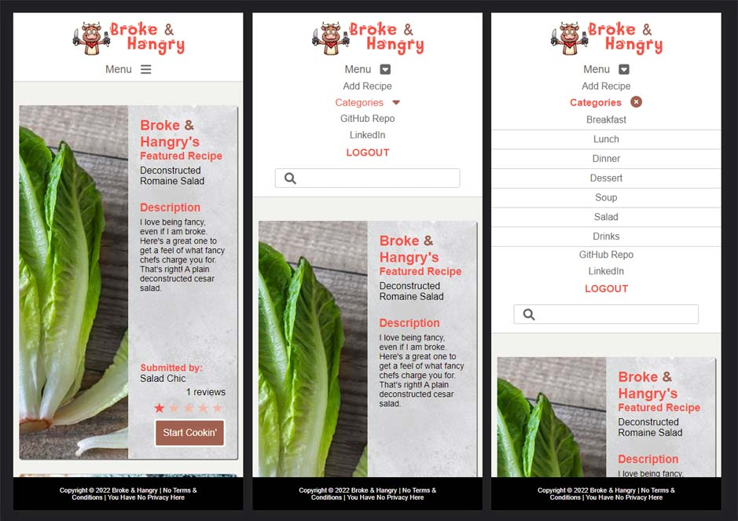
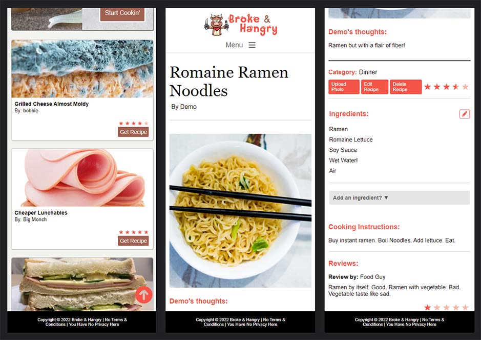
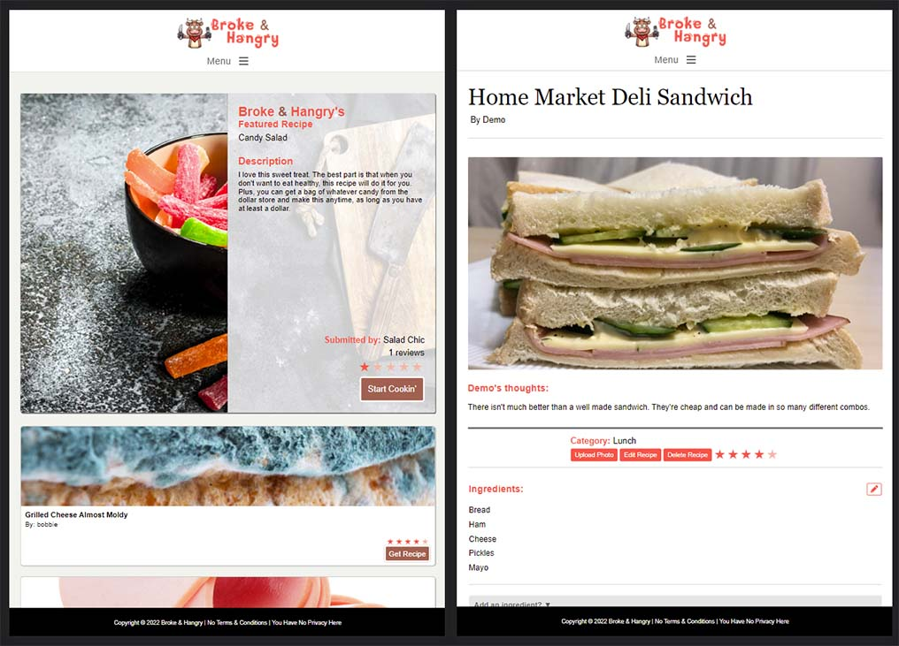

# Broke & Hangry
This is a clone of [Cooking by NY Times](https://cooking.nytimes.com/).

Where else to go get ideas for cheap eats when you are a broke college or boot camp student? Broke & Hangry, of course! Access the [Broke & Hangry MVP](https://brokehangry.herokuapp.com/).

**Broke & Hangry** is the place to go to share your budget recipes as a broke college or boot camp student.

# Index
|
[MVP Feature List](https://github.com/katsutori/capstone/wiki/MVP-Feature-List) |
[Database Schema](https://github.com/katsutori/capstone/wiki/Database-Schema) |
[API Documentation]() |
[Frontend Routes]() |

# Technologies Used


Broke & Hangry was developed using React, Redux, Flask, and SQLAlchemy to create a model-view-controller (MVC) application. Heroku was used for production hosting, and AWS S3 was used to host files uploaded by users for use with the application.


# Clone Broke & Hangry

1. Clone this repository (only this branch)

   ```bash
   git clone git@github.com:katsutori/capstone.git
   ```
2. Install dependencies

      ```bash
      pipenv install --dev -r dev-requirements.txt && pipenv install -r requirements.txt
      ```

3. Create a **.env** file based on the example with proper settings for your
   development environment
4. Setup your PostgreSQL user, password and database and make sure it matches your **.env** file

5. Get into your pipenv, migrate your database, seed your database, and run your flask app

   ```bash
   pipenv shell
   ```

   ```bash
   flask db upgrade
   ```

   ```bash
   flask seed all
   ```

   ```bash
   flask run
   ```

6. To run the React App, cd into the `react-app` directory.

   ```bash
   npm install
   ```

   ```bash
   npm start
   ```
# Key Functionalities
## Recipes, Categories, and Ingredients
Broke & Hangry allows users to liberally add recipes to the application to include recipe information and ingredients (independent of recipe data). Users also attribute recipes to categories that were predefined by the application developer. Recipes can also accommodate a featured image per recipe after a recipe's creation.
## Reviews
Users can add reviews to any recipe on Broke & Hangry, which includes a star rating from one through five. Each recipe averages the total ratings and displays the results when a recipe is "READ".

# Features Highlight
## Interactive Recipe Page
Building an interactive site is one thing, but making it INTERACTIVE is another. Like a fine Swiss automatic watch, Broke & Hangry's individual recipe pages bring a number of complications under the hood while delivering on smooth, simple, and featureful experiences for users. Users can CRUD reviews and CRUD ingredients on the same page without having to navigate away nor refreshing. OPs also have the option to use off-page features, such as adding photos and editing the meat and potatoes of their recipes with the simple click of a button.


## Star Ratings
What's the point in having reviews if you can't display a quick one-two for users to see a recipe' s ratings? While not technically challenging, seeing stars fill out in fractions is pretty cool! Because while you might like a 4.5 stars rated recipe, a 4.9 is even better!


## Responsive Design
Broke & Hangry was designed for students, so they're either on their phones, tablets, or occasionally, their laptops when not paying attention in classes. This application's navigation and containers switch from desktop view to mobile view at 820px to improve user experience on all devices.
## Mobile Phone View


## Tablet View


# Challenges Highlight
## Interactive Recipe Page
So many components. So many moving parts. When one bug is squashed, another shows up. Bugs are like roaches, except they're the developer's fault. Developing an interactive page has its challenges when your conditionals are logically flawed. Don't not logic.

Showing and hiding controls was initially a problem when using boolean triggers. Use index triggers instead when you are mapping out your components.


## PATCHING through Join Tables
Documentation is great until you cannot find them. When a PATCH requires a change to multiple tables, it was not easy. Well, it was. It just took some time to try different keyboard punches to get it to work. Remove your join then add a new one.


## Future Implementations
* Photo gallery that allows users to upload their interpretation of each recipe
* Cook book that allows users to save recipes to their favorite lists
* User profiles to allow users to view other users public information
* Notifications for when other users leave a review on your recipe
